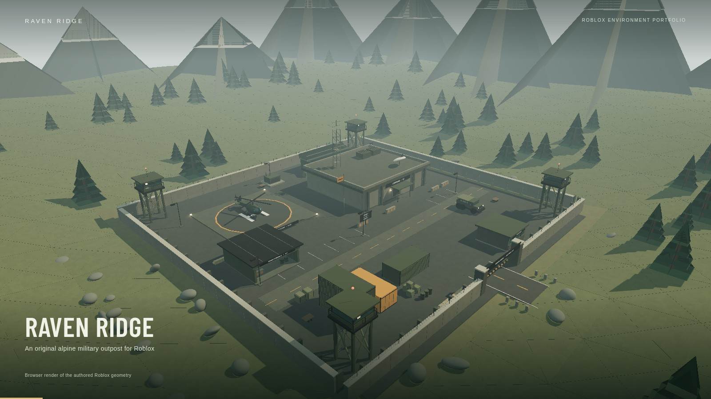
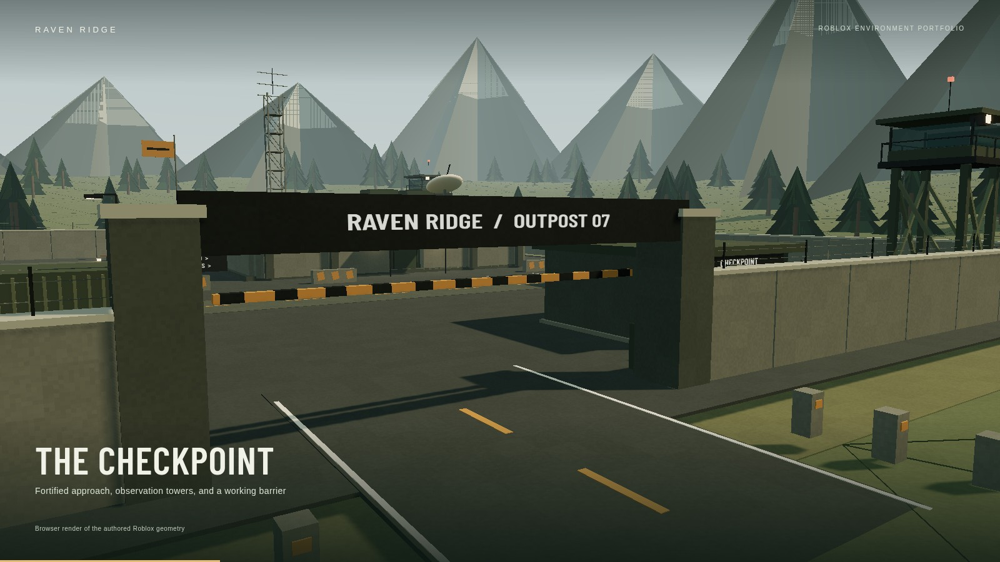
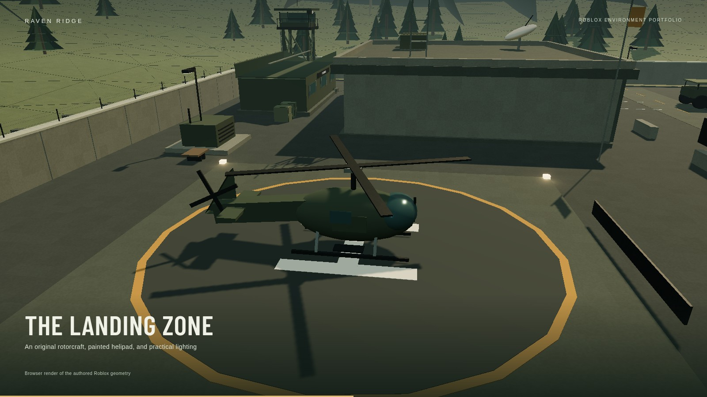
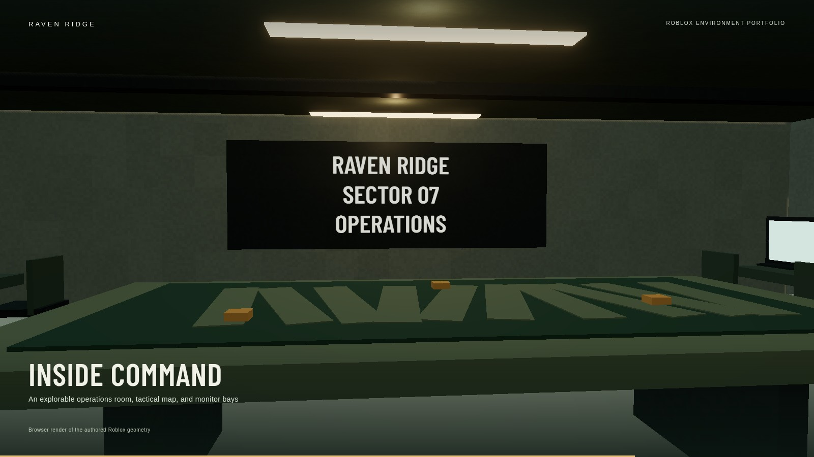
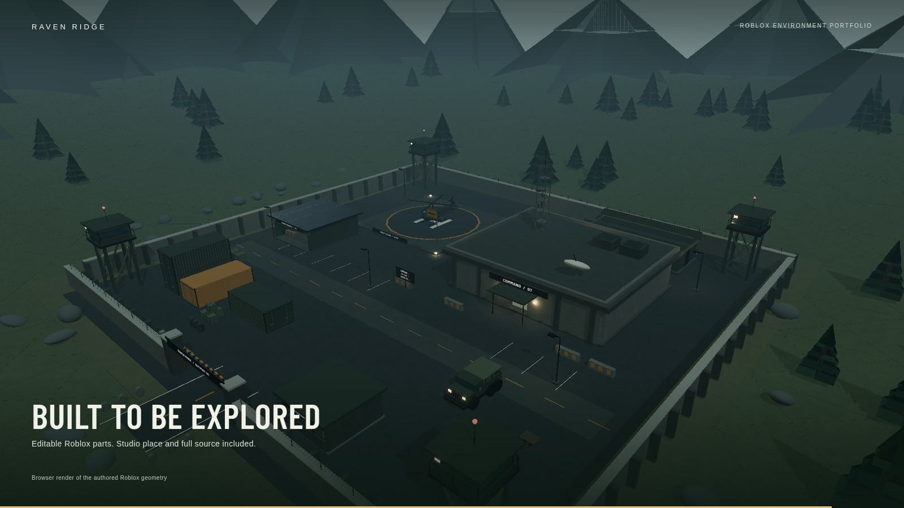

# Raven Ridge

**An original alpine military outpost for Roblox.** A newly built environment portfolio piece with modular architecture, custom vehicles, detailed interiors, and an explorable fortified compound.

[Explore the interactive preview](https://eunini.github.io/roblox-raven-ridge-outpost/) · [Download the walkthrough video](https://github.com/Eunini/roblox-raven-ridge-outpost/releases/latest/download/RavenRidge-Walkthrough.mp4) · [Download the Roblox place](https://github.com/Eunini/roblox-raven-ridge-outpost/releases/latest/download/RavenRidge.rbxl)



## The environment

- Fortified approach with road markings, checkpoint booth, proximity-controlled barrier, modular perimeter walls, and four observation towers.
- Concrete command bunker with a sliding entrance, briefing map, operations desks, monitor bays, practical lights, and rooftop communications.
- Painted helipad and an original, static rotorcraft built from native editable parts.
- Stacked corrugated shipping containers, original six-wheel military truck, fuel drums, crates, and supply props.
- Open maintenance pavilion, personnel barracks, generator enclosure, seating, signage, and service details.
- Continuous wedge-built alpine terrain, layered spruce trees, granite ridges, snow caps, and a river.

The generated environment contains **5,835 anchored parts in 16 named models**. There are no marketplace models or required external asset IDs. The scripts support architectural interactions and presentation; the vehicles are environment props.

## Open in Roblox Studio

1. Download `RavenRidge.rbxl` from [Releases](https://github.com/Eunini/roblox-raven-ridge-outpost/releases/latest). The editable XML `RavenRidge.rbxlx` is also included.
2. Open the file in Roblox Studio on Windows or macOS using **File → Open from File**.
3. The environment is already in `Workspace/RavenRidge`. Lighting, one approach-road spawn, server interactions, and the portfolio camera script are included.
4. Press **Play** to explore. Use the proximity prompts at the checkpoint control and bunker door. **F6** cycles presentation views, **F7** returns to the character, and **L** changes lighting locally.

The project was generated on Linux, where Roblox Studio is unavailable. Native file decoding and binary round-trip checks passed; **Studio rendering, collision behavior, and Luau runtime interactions still need a Studio playtest**. The walkthrough is clearly labeled as a browser render of the same authored geometry, not Roblox gameplay footage.

## Close views

| Checkpoint | Landing zone |
| --- | --- |
|  |  |

| Command interior | Dusk |
| --- | --- |
|  |  |

## Build and preview

Requirements: Python 3.10+ and Node.js 22+.

```sh
npm ci
npm run generate
npm run verify
npm run dev
```

`tools/build_scene.py` authors both the Roblox place and the browser manifest, so the two exports share the geometry. Edit the generator to revise the build. `src/` holds the embedded native Luau sources. `build/manifest.json` lists the measured part counts by model.

```sh
npm run build
```

This produces the static preview in `dist/`. GitHub Actions verifies the scene and publishes the preview to GitHub Pages on pushes to `main`.

## Record the walkthrough

Run the development server in a separate terminal, install the Playwright browser, and make sure FFmpeg is on your PATH:

```sh
npx playwright install chromium
npm run record
```

The recorder captures actual rendered browser frames and encodes a 1920×1080, 24 fps MP4. The camera sequence shows seven views over 50 seconds. The output is `media/RavenRidge-Walkthrough.mp4`, with recording details in `media/recording-evidence.json`. Frames are cached under the ignored `.recording/` directory so an interrupted run can resume; changing scene or rendering sources selects a fresh cache. Set `CHROMIUM_PATH` if using an existing browser installation, and `DEMO_URL` if the dev server uses another address.

For the independent native file check, install [rbxmk](https://github.com/Anaminus/rbxmk) and run:

```sh
rbxmk run tools/roundtrip.lua
```

That check decodes the `.rbxlx`, writes a binary `.rbxl`, reads it back, and checks that the instance count survives. It does not execute the Roblox runtime.

## Credits and use

Authored for Daniel Lordson as a new personal portfolio piece. It represents newly created work, not a completed client commission. Barlow Condensed uses the included SIL Open Font License. Third-party dependencies retain their own licenses. See [build notes](docs/BUILD-NOTES.md) for design decisions, sources, and validation limits.
